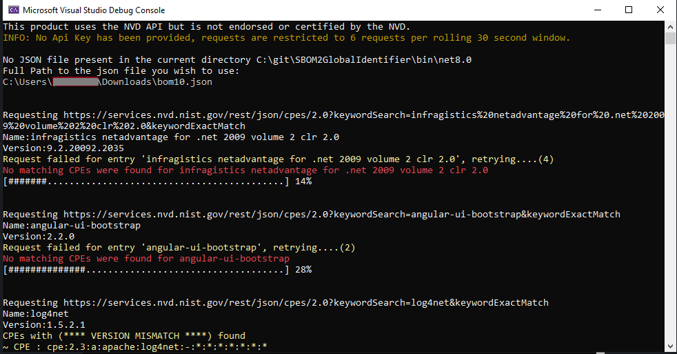
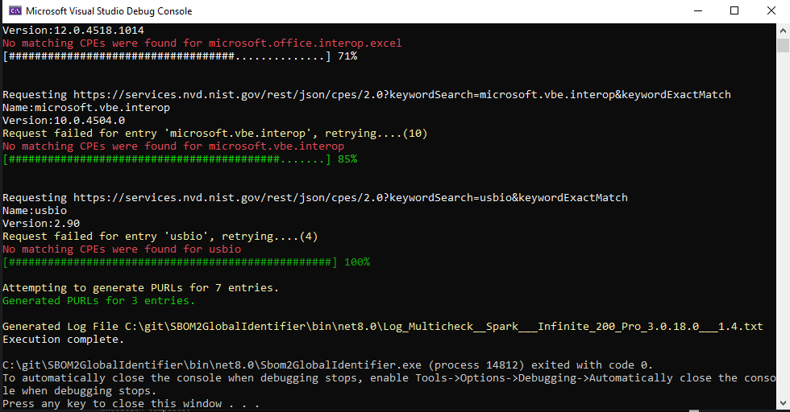
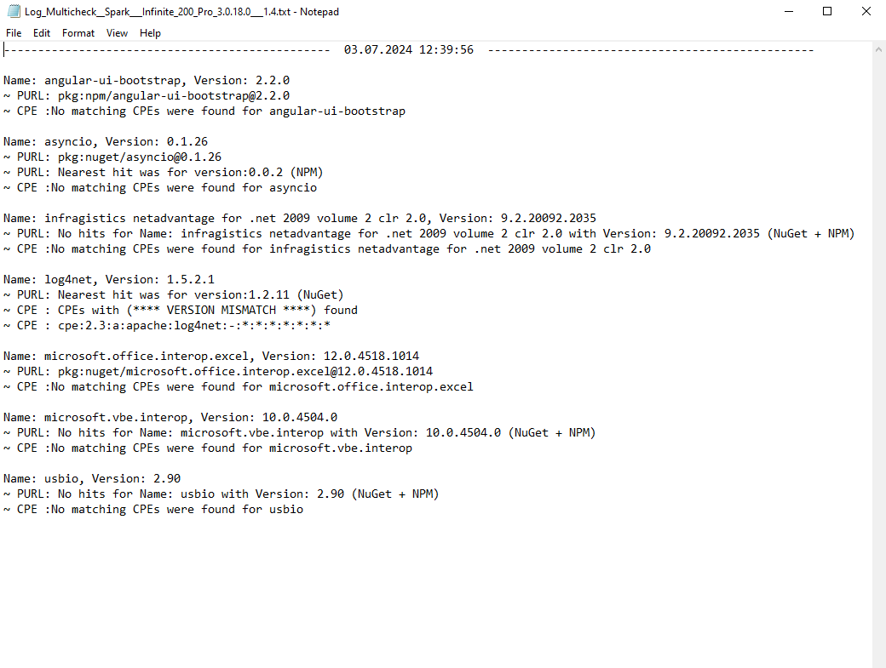
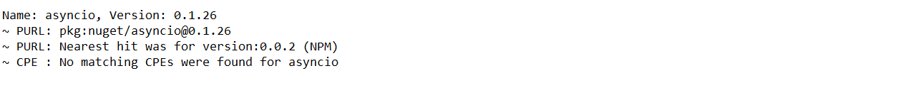

# Sbom2GlobalIdentifier

## Description
Sbom2GlobalIdentifier aims to solve the issue for SBOM files where the SBOM files dont contain global identifiers like PURLs and CPEs of the assemblies.
The tool is a C# script that takes in JSON files as input to perform CPE lookups in the NVD database. It also creates PURLs for all the valid assemblies present in the provided SBOM file by performing lookups in the NuGet and NPM databases for the creation of the PURLs.
***!!The input JSON file must be a valid SBOM file*** [(CycloneDX v1.4 JSON Reference)](https://cyclonedx.org/docs/1.4/json/)

There are 2 ways to feed the input to the Tool.
1. Place the JSON file in the same directory as the executable. (_The name must start with ‘bom’_)
2. Provide the tool with a valid input file at runtime (_The name does not necessarily have to start with ‘bom’_).


The tool window will look something like this while its running:



Note: You can speed the Tool up by providing an Api Key to NVD either as args or having a file nvd_accelerator.txt in the CWD of the executable (*this file should only have your Api key to NVD, nothing else*). Without an API key however, NVD restricts requests to 5 requests per rolling 30 second window, meaning the tool will send 1 request every 6-7 seconds.
[NVD - API Key Request](https://nvd.nist.gov/developers/request-an-api-key)


```
//the tool accepts the first argument passed as the api key
if( args.Length > 0 )
{
    ApiKey = args[0];
}
else if( File.Exists( Constants.SECRETS_FILE ) && !string.IsNullOrEmpty( Constants.SECRETS_FILE ))
{
    ApiKey = File.ReadAllText( Constants.SECRETS_FILE );
}
Example usage: ./Sbom2GlobalIdentifier.exe 0123456789
```


---


After execution, the Tool will create a log file under the working directory of the Tool.



The log file will contain the summary of the Findings for each valid entry provided in the input file. The Tool is more sensitive in case of searching for CPEs because in our case of finding vulnerabilities, a False Negative is more harmful than a False Positive. In case of PURL generation, the Tool strictly only creates PURLs for exact matches, but lets the user know that a similar PURL exists in case the tool finds a close match to the assembly.




Note: In some cases you may see such output for PURLs



Since a package can be existing with the same name and version in both NuGet and NPM, the tool does not stop once a PURL is created for a platform. Even if it creates the PURL for the package that is available in NuGet, it still checks if a PURL can be generated for the package if it is available in NPM. This behavior is intentional as to not miss creation of PURLs for packages existing in both platforms.
