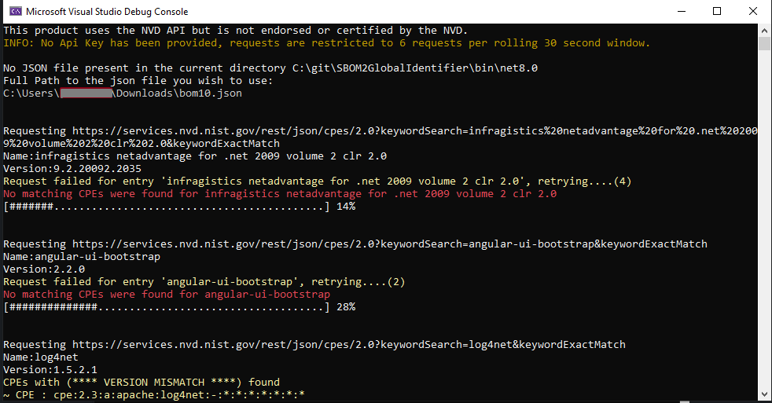
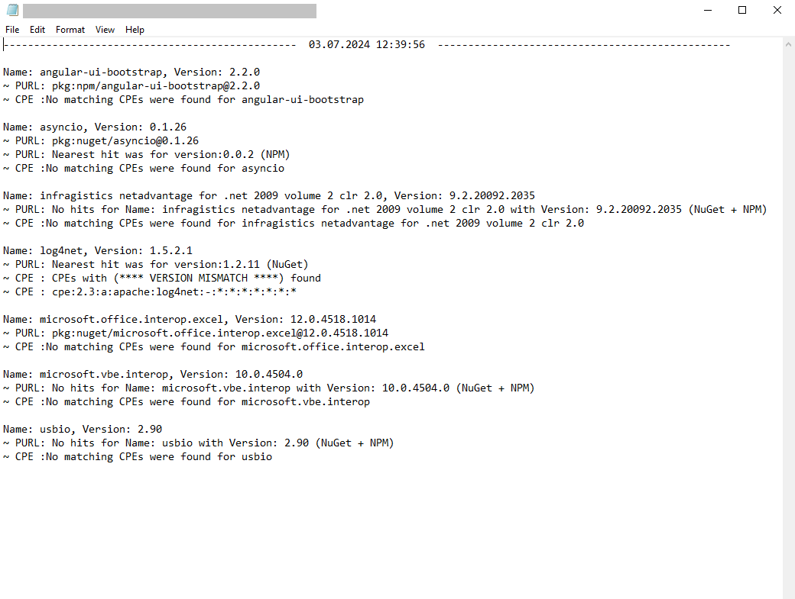

# Sbom2GlobalIdentifier

## Description
Sbom2GlobalIdentifier aims to solve the issue for SBOM files where they dont contain global identifiers like PURLs and CPEs of the components.
The tool is a C# script that takes in JSON files as input to perform CPE lookups in the NVD database as well as create PURLs for all the valid assemblies/components present in the provided SBOM file by performing 
lookups in the NuGet and NPM databases for the creation of the PURLs.
***!!The input JSON file must be a valid SBOM file*** [(CycloneDX v1.4 JSON Reference)](https://cyclonedx.org/docs/1.4/json/)

There are 3 ways to feed the input to the Tool.
1. Provide the directory path as argument to the executable. (The name of the files in the specified directory must start with ‘bom’)
2. Place the JSON file in the same directory as the executable. (The name of the files must start with ‘bom’) 
3. Provide the tool with a valid input file at runtime (The name does not necessarily have to start with ‘bom’).

### Command Line Arguments:
-a || --apiKey == the apiKey to NVD, which can be obtained at [NVD-Request an API Key](https://nvd.nist.gov/developers/request-an-api-key)

-d || --dirPath == path to a directory with valid SBOM file(s).

-r || --resultPath == path to a directory where you wish the result file to be created. If not provided, the result files will be created in the CWD of the tool.

-m || --maxRetryCount == specifies the max number of retry count for a specific component. Is set to 20 by default/when not specified.

-x || --exclude == string (case insensitive) to be used for pattern matching. The tool will avoid using the components from the input file that contain this string in their name.
 For example if  -x pIzZa is specified and the SBOM file contains a component, whose name contains ‘pizza’, the tool will ignore this assembly completely ( attention: case insensitive )
`
//for an object in the components array which has the excluded string in its 'name', this component will be completely ignored
components : [
    {
      name : TestpizzaComponent,     //this object will be ignored since the name contains the exclude string
      version : 0.1.26.0,
      description : test pizza,
      purl : pkg:nuget/pizza0.1.26.0,
      type : library,
      bom-ref : 9sdc1e8e-s0da-21sz-86af-1682s37t38bf
    },
    {
        ....
    },
    ...
]
`

---

The tool window will look something like this while its running:

Note: You can speed the Tool up by providing an API Key to NVD by either providing the key as args (using --apiKey <apiKey>) or having a this exact file `
nvd_accelerator.txt` in the CWD of the executable (the file should only have your API key to NVD, nothing else). Without an API key, NVD restricts requests to 5 requests per rolling 30 second window, which means the tool will send 1 request every 6-7 seconds to mitigate HttpForbidden responses.
[NVD - API Key Request](https://nvd.nist.gov/developers/request-an-api-key)

`
if( !string.IsNullOrEmpty( arg ) ) //where arg is the string provided using --apiKey
{
    ApiKey = arg;
}
else if( File.Exists( Constants.SECRETS_FILE ) && !string.IsNullOrEmpty( Constants.SECRETS_FILE ) ) //where Constants.SECRETS_FILE is nvd_accelerator.txt 
{
    ApiKey = File.ReadAllText( Constants.SECRETS_FILE );
}
`

---

### Example usage:
 ./Sbom2GlobalIdentifier.exe -a 12345678 -d c:\git\validSboms -x pizza -l c:\git\validSboms\logFiles -m 5
 
./Sbom2GlobalIdentifier.exe --apiKey 12345678 --dirPath c:\git\validSboms --exclude pizza --logPath c:\git\validSboms\logFiles --maxRetryCount 5

---

After an execution, the Tool will create a result file.

The result file will contain the summary of the Findings for each valid entry provided in the input file. The Tool is more sensitive in case of searching for CPEs because in our case of finding vulnerabilities, a False Negative is more harmful than a False Positive. In case of PURL generation, the Tool strictly only creates PURLs for exact matches, but lets the user know that a similar PURL exists in case the tool finds a close match to the assembly.

Note: In some cases you may see such output for PURLs

Since a package can be existing with the same name and version in both NuGet and NPM, the tool does not stop once a PURL is created for a platform. Even if it creates the PURL for the package that is available in NuGet, it still checks if a PURL can be generated for the package if it is available in NPM. This behavior is intentional as to not miss creation of PURLs for packages existing in both platforms.
